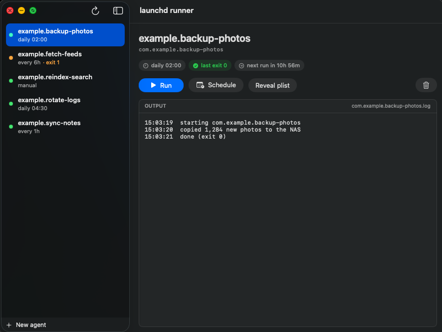

# launchd runner

A small macOS app for running your own `launchd` agents by hand and watching what they do.

`launchd` is good at running things on a schedule and bad at everything around that.
To trigger one of your own jobs right now you have to remember its label, type
`launchctl start com.you.thing`, then work out which file that particular job writes
to before you can `tail` it. This does those three things for you.



## What it does

- Lists every agent in `~/Library/LaunchAgents`, minus the ones belonging to Apple,
  Google and Homebrew — the list is what *you* installed
- Shows each one's schedule (`daily 11:30`, `every 1h`, `manual`) and next fire time
- Shows the exit code of the last run, so a job that has been quietly failing is visible
- **Runs one now** and streams its output live, from whichever log it actually writes to
- **Changes a schedule** without opening the plist in an editor
- **Creates a new agent** from a script, a schedule and a log path

## Install

Needs the Xcode Command Line Tools for `swiftc` (`xcode-select --install`).
Nothing else: SwiftUI ships with macOS, so the built app has no dependencies.

```sh
git clone https://github.com/<you>/launchd-runner
cd launchd-runner
./install.sh              # builds and installs to ~/Applications
./install.sh /Applications  # or somewhere else
```

Then open it from Spotlight (⌘Space, "launchd") or drag it to the Dock.

## Finding the log

A job's `StandardOutPath` is frequently a near-empty file that only catches what
launchd itself prints, while the real record goes to a log the script opens on its
own. So rather than trusting one key, the app notes the size of every plausible log
around the job before starting it — `StandardOutPath`, `StandardErrorPath`, and any
`*.log` beside them — and then follows whichever file actually grows. That means it
finds the right log without you configuring anything per job.

## Editing and creating

Both write real launchd config, so they are careful about it:

- The plist is serialised and validated in memory, written to a temp file, then moved
  into place in one step — a crash mid-write cannot leave launchd reading half a file.
- The previous version is kept alongside as `<label>.plist.bak`.
- Saving reloads the agent (`launchctl bootout` then `bootstrap`), because launchd
  reads a plist once at load time and a schedule change does nothing until then.
- A job that is running right now cannot be edited; reloading it would kill it.
- Creating checks the label looks like a label, that it is not already taken, and
  that the script exists and is executable.

`test/selftest.sh` round-trips all of that against real launchd with a scratch agent
that it removes afterwards. Run it before changing `PlistWriter`.

## What it deliberately does not do

- **Delete agents.** Removing a plist is a `rm` you should mean, and an undo-less
  delete button in a list you navigate with arrow keys is a bad trade.
- **Show system agents.** `launchctl list` has hundreds of Apple entries. None of
  them are yours to trigger.
- **Edit anything but the schedule.** Arbitrary plist editing is what a text editor
  is for; this covers the field people actually change.

## Notes

- Requires macOS 14 or newer.
- The app is signed ad-hoc at build time, which is enough to launch something you
  compiled yourself. It is not notarized — you built it, so there is nothing to
  notarize against.
- Interval jobs (`StartInterval`) get no "next run" estimate. The phase depends on
  when launchd last started the job, which isn't readable, and a wrong countdown is
  worse than none.

## License

MIT — see [LICENSE](LICENSE).
